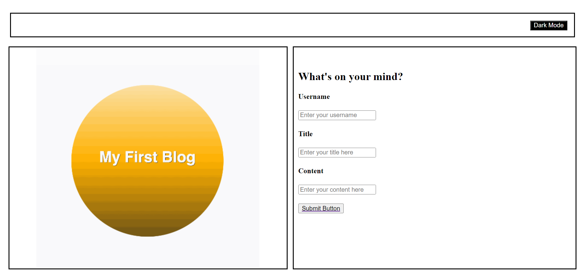

# Robert's Tech Blog

## Blog App

The motivation for this project was to practice dynamically creating elements, where once created I can use methods such as set attributes to add id's and css. Also practiced the append and appendChild methods where these insert the elements in a particular place in html. Also practiced sending an array with objects to the local storage to then be retrieved and displayed in the blog.html page. This was done dynamically through blog.js , javascript code that retrieves from local storage and displays to page. Also practiced having buttons run eventlistener functions as well as having them link to other pages, example: button in index.html takes me to blog.html.

I learned how implementing the use of the following functions:

 forEach = which takes in an array and cycles through what's inside the array (elements), in this case it was the objects stored in the array. 

 append = can be used to dynamically set multiple html elements.

 appendChild = can be used to dynamically set one html element at a time. 

 setAttribute = can be used to add id's and style to html elements.

## Table of Contents

1). Robert's Tech Blog webpage.

## Usage

github pages url: https://robscafe433.github.io/BlogCenter/

Github repository: https://github.com/robscafe433/BlogCenter

Webpage Screenshot:

<!-- example code below -->
   

## Badges

